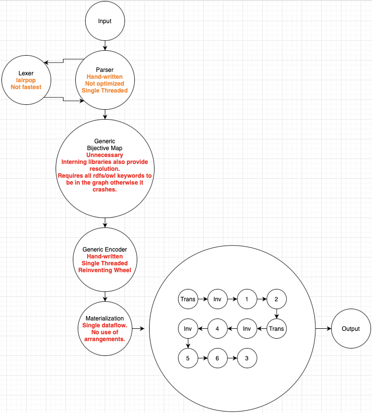

A `Friendly RDFS+` materalizer.

Why is called `Friendly`?

It's nigh guaranteed that whenever someone tries to explain transitivity, they will give the "friendsOf" example i.e if a is friends with b and b is friends with c, then a is friends with c.

All of `rhoDF` + `owl:inverseOf` + `owl:TransitiveProperty`.

What is there to do:

[ ] - Rewrite the whole encoder stuff and use the `lasso` string interning library alongside `logos` for lexing. (although I'm not even sure that we even need a lexer).

[ ] - Update `differential` and `timely` to 0.12.0.

[ ] - Make it so that `rdfs_keywords` under `experiments/lib.rs` is a hashmap. At the moment we have a stupid problem which is that in case the `tbox` has no mention of an `rdfs` or `owl` keyword, the program won't run. 

[ ] - Refactor all usage of `timely` and `differential`. There's **a lot** of code duplication and unnecessary calls. 

[ ] - Remove all unnecessary/experiment cruft.

[ ] - Allow building views through `SPARQL`.

In short, this is how the current architecture looks like:

And this is how I think things should be:

